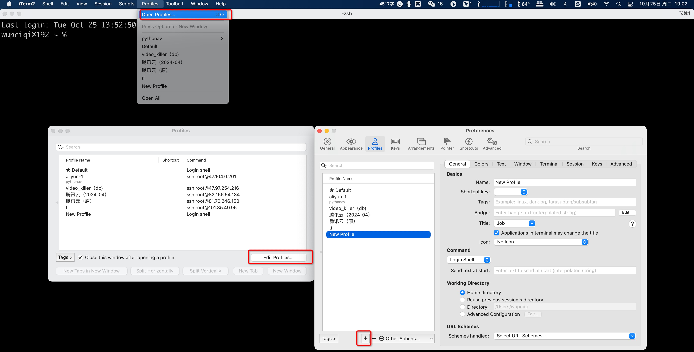
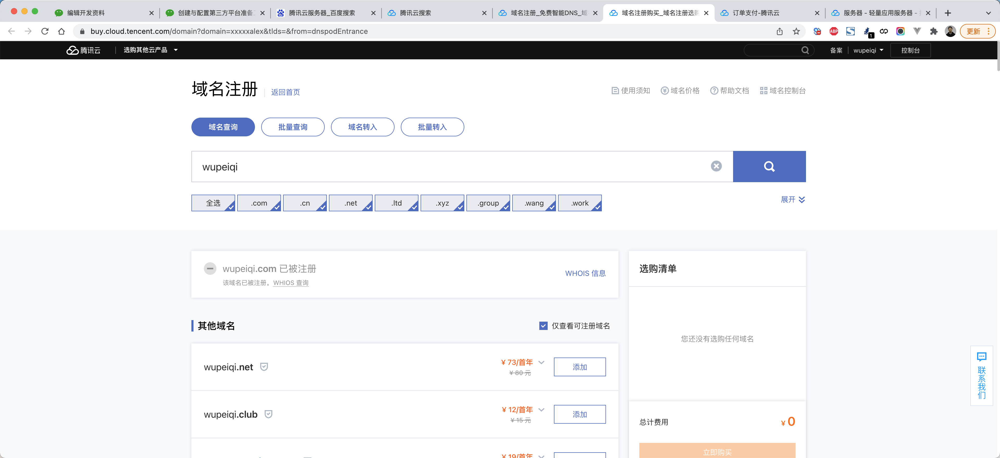
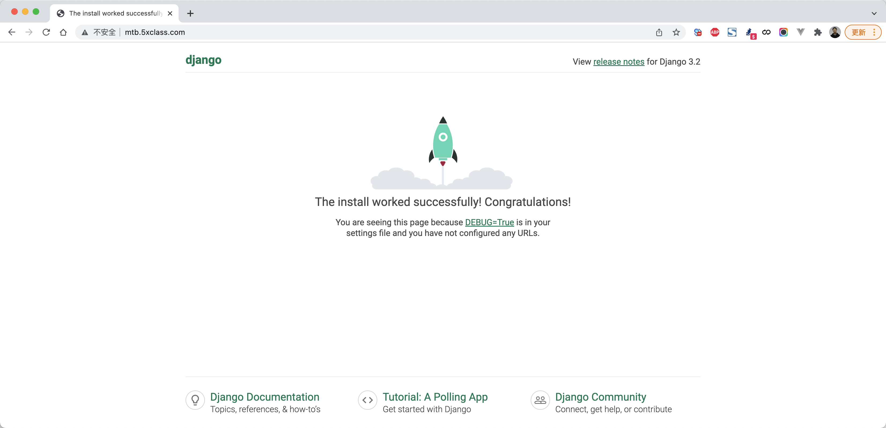

# day28 Web项目部署


本质三件事：

- 租个服务器（含公网ip）+ 配置环境

  ```
      电脑 + 公网IP
  自己电脑 + 拉专线
  ```

- 代码放在服务器

- 程序运行起来


## 1.购买云服务器

在阿里云、腾讯云或其他平台 购买一台云服务器（选便宜的）。

以下是以 腾讯云 + centos 7.5 操作系统来进行操作。


请记住自己的公网IP，后续用户访问和我们远程登录时，均使用这个IP：

```
82.156.54.134

-[我们]自己电脑远程登录上服务器，在服务器安装各种服务+代码+启动
-[用户]访问程序
```


当购买成功且安装好操作系统之后，请先配置安全组：


## 2.远程登录

后续部署时，需要对服务器进行操作，哪我们必须能登录上服务器才行。


### 2.1 win系统

可以使用 xshell、SecureCRT 等工具。


### 2.2 iTerm2

mac系统可以使用 内置终端、iTerm2等。

https://iterm2.com/




按照上述操作，每次都输入密码，太麻烦了。

在我们本地想要通过SSH连接服务器，每次连接都输入密码也觉得比较烦，此时也可以使用秘钥的方式直接连接服务器。

```
>>>ssh-keygen -t rsa    这个命令不需要做了，因为在之前git上传代码时已执行过（已有公钥和私钥）
```

```
>>>ssh-copy-id  -i  ~/.ssh/id_rsa.pub  root@82.156.54.134
```


那么以后再想要登录远程服务器，就不需要再输入账户和密码了，直接输入：

```
>>>ssh root@82.156.54.134
```


## 3.代码同步

https://git-scm.com/downloads


上传代码的方式有很多种，例如：FTP工具、scp命令、rsync服务、svn等，不过目前公司主流的都是使用git+代码托管平台。


- 本地电脑，安装git并使用git命令上传代码。
- 代码仓库，创建仓库。
- 服务器，安装git并使用git命令获取最新代码。


### 3.1 本地上传

在本地电脑上本质上需要执行如下步骤：

- 全局配置

  ```
  git config --global user.name "武沛齐"
  git config --global user.email "wupeiqi@live.com"
  ```

- 进入项目目录

  - 初始化

    ```
    git init
    ```

  - 配置远程地址

    ```
    git remote add origin https://gitee.com/wupeiqi/xxxxx.git
    ```

  - 本地版本提交

    ```
    git add .
    git commit -m '提交说明...'
    ```

  - 提交到远程仓库

    ```
    git push origin master
    ```


#### 关于gitignore

在项目中创建一个 `.gitignore`的文件，在里面写上文件名或文件夹，可以git忽略一些文件，不要进行版本控制。

```
https://github.com/github/gitignore/blob/main/Python.gitignore
```


将Python的ignore文件内存拷贝并保存至项目目录下。


这样，就可以控制git忽略某些文件。


#### 关于密码或秘钥

本地提交代码时，每次需要输入密码 & 线上服务器拉去代码时，每次也需要输入密码。

- 固定用户名和密码

  ```
  git remote remove origin
  git remote add origin https://用户名:密码@gitee.com/wupeiqi/xxxxx.git
  ```

- 使用SSH

  - 使用ssh-keygen命令，生成一对秘钥（公钥和私钥）

    ```
    ssh-keygen -t rsa
    ```

    

  - 读取公钥 `~/.ssh/id_rsa.pub`内容并上传到代码托管仓库
    

    

  - 推拉数据

    ```
    git remote add origin git@gitee.com:wupeiqi/xxxxx.git
    git push origin master
    ```

    ```
    git clone git@gitee.com:wupeiqi/xxxxx.git
    ```

    


### 3.2 线上同步

登录线上服务器并获取代码，本质上需要以下三个步骤：

- 登录服务器

  ```
  - 云平台网页版：支持登录并进行命令交互（不便捷，不推荐）。
  - SSH工具，连接比较方便（推荐）
  	- win：xshell、SecureCRT
  	- mac：iTerm2
  
  注意：如果使用SSH工具连接远程服务器的话，需要在云平台的的安全组开启22端口权限。
  ```

- 安装git

  ```
  yum install git -y
  ```

  

- 进入项目克隆或拉取代码

  ```
  基于用户名和密码，需要输入用户和密码
  	git clone https://gitee.com/wupeiqi/xxxxx.git
  	
  基于用户名和密码，直接集成用户和密码
  	git clone https://用户名:密码@gitee.com/wupeiqi/xxxxx.git
  
  基于秘钥：
  	>>>ssh-keygen -t rsa
  	>>>cat ~/.ssh/id_rsa.pub
  	>>>拷贝公钥到代码仓库
  	>>>git clone git@gitee.com:wupeiqi/xxxxx.git
  ```


## 4.配置和部署

### 4.1 MySQL

- 安装服务端

  ```
  yum install mariadb-server -y
  ```

  ```python
  mariadb-server.x86_64 1:5.5.68-1.el7
  ```

- 安装客户端

  ```python
  yum install mariadb -y
  ```

  ```python
  软件包 1:mariadb-5.5.68-1.el7.x86_64 已安装并且是最新版本
  ```

- 服务配置

  - 启动

    ```
    systemctl start mariadb
    systemctl stop mariadb
    ```

  - 设置开机启动

    ```
    systemctl enable mariadb
    ```

- 账号初始化

  - 登录

    ```
    mysql -u root -p
    ```

  - root设置密码

    ```
    UPDATE user SET password=password('qwe123..') WHERE user='root'; 
    flush privileges;
    ```

  - 创建用户

    ```
    insert into mysql.user(user,host,password) values('s4','%',password('qwe123..'));
    flush privileges;
    
    # 或更新密码
    UPDATE user SET password=password('qwe123..') WHERE user='xxx'; 
    flush privileges;
    ```
  
  
  
- 创建数据库
  
    ```
    CREATE DATABASE s4big DEFAULT CHARSET utf8 COLLATE utf8_general_ci;
  ```
  
- 授权
  
    ```
    grant all privileges on 数据库.* to settle@'%';
    flush privileges;
  ```
  
    ```
  grant all privileges on s4big.* to s4@'%';
  flush privileges;
    ```
  
    


### 4.2 Python3

- 安装gcc，用于后续安装Python时编译源码。

  ```python
  yum install gcc -y
  ```

- 安装Python3相关依赖

  ```
  yum install zlib zlib-devel -y
  yum install bzip2 bzip2-devel  -y
  yum install ncurses ncurses-devel  -y
  yum install readline readline-devel  -y
  yum install openssl openssl-devel  -y
  yum install xz lzma xz-devel  -y
  yum install sqlite sqlite-devel  -y
  yum install gdbm gdbm-devel  -y
  yum install tk tk-devel  -y
  yum install mysql-devel -y
  yum install python-devel -y
  yum install libffi-devel -y
  ```

- 下载Python源码，https://www.python.org/ftp/python/

  ```
  cd /data/
  wget https://www.python.org/ftp/python/3.9.5/Python-3.9.5.tgz
  ```

  注意：如果没有wget，则先安装 `yum install wget -y`

- 编译安装

  - 解压

    ```
    tar -xvf Python-3.9.5.tgz
    ```

  - 进入目录并编译安装

    ```
    cd Python-3.9.5
    ./configure
    make all
    make install
    ```

  - 测试

    ```
    >>>python3 --version
    
    /usr/local/bin/python3
    /usr/local/bin/pip3
    /usr/local/bin/pip3.9
    ```

  - 配置豆瓣源（腾讯云服务器，默认腾讯源）

    ```
    pip3.9 config set global.index-url https://pypi.douban.com/simple/
    ```


### 4.3 虚拟环境

- 安装虚拟环境

  ```
  pip3.9 install virtualenv
  ```

- 创建虚拟环境目录并创建虚拟环境

  ```
  mkdir /envs
  virtualenv /envs/nb --python=python3.9
  ```

- 安装项目依赖的pip包

  ```
  source /envs/nb/bin/activate
  pip install flask
  pip install pymysql
  pip install dbutils
  ```
  
  ```
  cd /data/项目目录/
  pip install -r requirements.txt
  ```


### 4.4 uwsgi

激活虚拟环境并安装uwsgi

```
source /envs/nb/bin/activate
pip install uwsgi
```


基于uwsgi运行项目

- 命令参数

  ```
  uwsgi --http :80 --wsgi-file app.py  --callable app
  ```

- 文件参数（推荐）

  - 创建 nb_uwsgi.ini

    ```ini
    [uwsgi]
    socket = 127.0.0.1:8001
    chdir = /data/www/s4big/
    wsgi-file = app.py
    callable = app
    processes = 1
    virtualenv = /envs/nb/
    ```

  - 执行命令

    ```
    source /envs/nb/bin/activate
    uwsgi --ini  nb_uwsgi.ini
    ```


### 4.5 nginx

利用nginx做反向代理和处理静态文件。

```
yum install nginx -y
```


修改nginx.conf配置文件： `/etc/nginx/nginx.conf`

```
user nginx;
worker_processes auto;
error_log /var/log/nginx/error.log;
pid /run/nginx.pid;

# Load dynamic modules. See /usr/share/doc/nginx/README.dynamic.
include /usr/share/nginx/modules/*.conf;

events {
    worker_connections 1024;
}

http {
    log_format  main  '$remote_addr - $remote_user [$time_local] "$request" '
                      '$status $body_bytes_sent "$http_referer" '
                      '"$http_user_agent" "$http_x_forwarded_for"';

    access_log  /var/log/nginx/access.log  main;

    sendfile            on;
    tcp_nopush          on;
    tcp_nodelay         on;
    keepalive_timeout   65;
    types_hash_max_size 4096;

    include             /etc/nginx/mime.types;
    default_type        application/octet-stream;


    upstream flask {
        server 127.0.0.1:8001;
    }

    server {
        listen       80;
        listen       [::]:80;

        # Load configuration files for the default server block.
        # include /etc/nginx/default.d/*.conf;

		location /static {
            alias  /data/www/s4big/s4big/static;
        }

        location / {
            uwsgi_pass  flask;
            include     uwsgi_params;
        }

    }
}
```


接下来就需要启动uwsgi和nginx：

- nginx

  ```
  # 启动
  systemctl start nginx
  systemctl stop nginx
  
  # 开机启动
  systemctl enable nginx
  ```

- 脚本

  ```
  ./reboot.sh
  ./stop.sh
  ```
  
  

每次启动都比较麻烦，怎么办？


### 4.6 shell脚本

##### reboot.sh

```bash
#!/usr/bin/env bash

echo -e "\033[34m--------------------wsgi process--------------------\033[0m"

ps -ef|grep nb_uwsgi.ini | grep -v grep

sleep 0.5

echo -e '\n--------------------going to close--------------------'

ps -ef |grep nb_uwsgi.ini | grep -v grep | awk '{print $2}' | xargs kill -9

sleep 0.5

echo -e '\n----------check if the kill action is correct----------'

/envs/nb/bin/uwsgi  --ini nb_uwsgi.ini &  >/dev/null

echo -e '\n\033[42;1m----------------------started...----------------------\033[0m'
sleep 1

ps -ef |grep nb_uwsgi.ini | grep -v grep
```

```
chmod 755 reboot.sh
./reboot.sh
```


##### stop.sh

```bash
#!/usr/bin/env bash

echo -e "\033[34m--------------------wsgi process--------------------\033[0m"

ps -ef |grep nb_uwsgi.ini | grep -v grep

sleep 0.5

echo -e '\n--------------------going to close--------------------'

ps -ef |grep nb_uwsgi.ini | grep -v grep | awk '{print $2}' | xargs kill -9

sleep 0.5
```


### 4.7 访问


### 4.8 域名和解析

#### 4.8.1 购买域名




#### 4.8.2 解析

就是让域名和我们刚才买的服务器绑定，以后通过域名就可以找到那台服务器，不需要再使用IP了。


解析成功后，基于域名就可以访问了。




注意：域名需要备案后才能使用。


## 扩展

- git相关

  ```
  https://www.bilibili.com/video/BV19E411f76x/
  ```

- https部署

  - 阿里云免费申请证书（1年）
  - 上传到服务器 + nginx修改配置
  - 重启nginx


